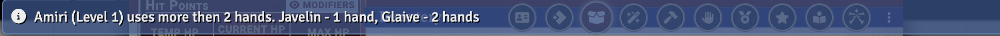

# PF2e Hands Management (Reminder)

[![Version]][Version URL]

## Module to notify about hands management
Hold items more than with 2 hands

## Patch Notes

See [CHANGELOG.md](./CHANGELOG.md)

### Contributing
See [CONTRIBUTING.md](CONTRIBUTING.md) and [CONTRIBUTORS.md](CONTRIBUTORS.md)

### Licenses

This module uses trademarks and/or copyrights owned by Paizo Inc., used
under [Paizo's Community Use Policy](https://paizo.com/community/communityuse). We are expressly prohibited from
charging you to use or access this content. This module is not published, endorsed, or specifically approved by Paizo.
For more information about Paizo Inc. and Paizo products, visit [paizo.com](paizo.com).

Open Game License:

* See [OpenGameLicense.md](OpenGameLicense.md)

[Version]: https://img.shields.io/badge/Version-0.1.0-yellow?style=flat-square
[Version URL]: https://github.com/reyzor1991/foundry-vtt-pf2e-notification